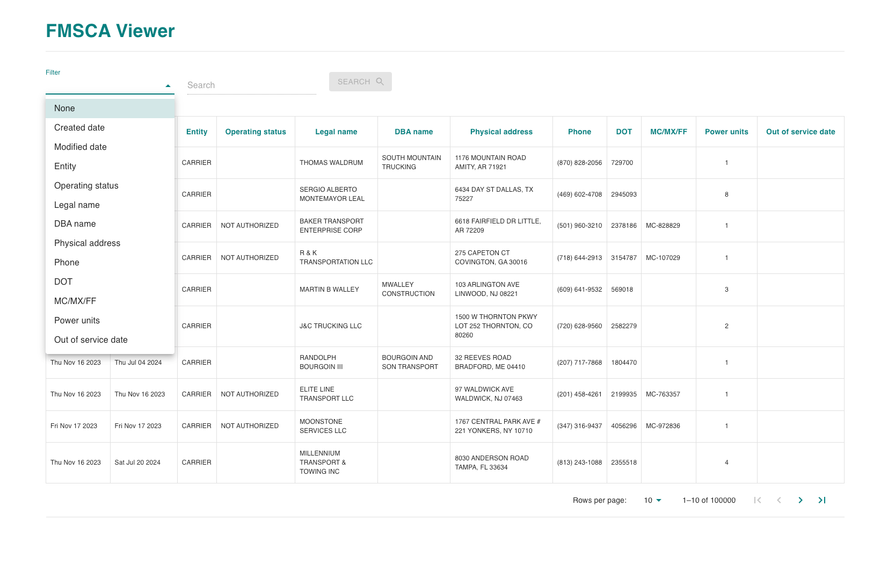
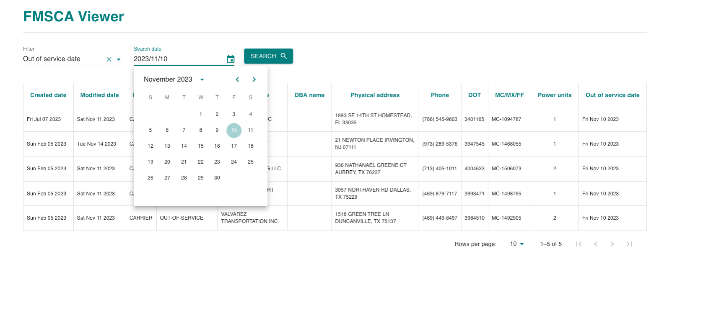

# FMSCA viewer

### Demo
[fmsca-viewer](https://fmsca.netlify.app/) 

### Installation
```
git clone https://github.com/Sergii5854/fmsca-viewer.git
```
```
cd fmsca-viewer
```
```
npm i 
# or
yarn install
```

```
npm run dev
```

### Technologies

- [React](https://react.dev/) - The library for web and native user interfaces
- [Material UI](https://mui.com/) - MUI offers a comprehensive suite of free UI tools to help you ship new features faster.

### Screenshots





